欢迎来到 Docker for Windows!

请阅读这些有关如何开始的主题. 如果要针对关于您使用该应用的体验、发现的错误或问题**向我们提供反馈**, 请登录 [Docker for Windows 论坛](https://forums.docker.com/c/docker-for-windows).

>**已经拥有 Docker for Windows?** 如果您已经安装了 Docker for Windows 并准备开始入门, 可以直接跳过到 [Docker 入门](/engine/getstarted/index.md)教程.

## 下载 Docker for Windows

如果还没有 Docker for Windows, 请现在安装. 您可以从稳定版或测试版通道获得安装程序, 要了解更多关于稳定与测试版本的信息, 参见 [FAQs](faqs.md#questions-about-stable-and-beta-channels).

<table style="width:100%">
  <tr>
    <th style="font-size: x-large; font-family: arial">稳定版</th>
    <th style="font-size: x-large; font-family: arial">测试版</th>
  </tr>
  <tr valign="top">
    <td width="50%">该安装程序已完全稳定并经过测试, 搭载了最新公开版本的 Docker Engine.<br><br>如果您希望工作在一个可靠的平台, 这是最佳的通道.<br><br>稳定版的发布遵循比测试版更长交付时间的版本计划, 与 Docker Engine 的发布与修补程序同步.
    </td>
    <td width="50%">该安装程序提供了先进的功能, 搭载了实验版本的 Docker Engine, 在 <a href="https://github.com/docker/docker/tree/master/experimental" target="_blank">Docker 试验性功能自述文件</a>中有描述.<br><br>这是体验我们正在开发中的功能的最佳通道, 但可能不稳定或存在问题. 该通道是测试版计划的延续, 您可以随着应用的发展提供反馈. 测试版的发布一般比稳定版频繁, 通常是每个月一次或多次.</td>
  </tr>
  <tr valign="top">
  <td width="50%">
  <a class="button darkblue-btn" href="https://download.docker.com/win/stable/InstallDocker.msi">获取 Docker for Windows (稳定版)</a><br><br>
  <a href="https://download.docker.com/win/stable/InstallDocker.msi.sha256sum"><font color="#BDBDBD" size="-1">下载校验和: InstallDocker.msi SHA256</font></a>
  </td>
  <td width="50%">
  <a class="button darkblue-btn" href="https://download.docker.com/win/beta/InstallDocker.msi">获取 Docker for Windows (测试版)</a><br><br>
  <a href="https://download.docker.com/win/beta/InstallDocker.msi.sha256sum"><font color="#BDBDBD" size="-1">下载校验和: InstallDocker.msi SHA256</font></a>
  </td>
  </tr>
</table>

>**重要信息:**
>
>- Docker for Windows 需要 64 位的 Windows 10 专业版, 企业版和教育版
>  (1511 十一月累计更新, Build 10586 或更新版本) 与 Microsoft Hyper-V. 请参见
>  [安装前须知](index.md#what-to-know-before-you-install) 获得完整的必备列表.
>
>- 您可以在测试与稳定版本之间切换, 但一次只能有一个应用程序的安装. 此外, 在卸载当前版本、安装另一个版本之前,
>  您需要保存镜像并导出希望保留的容器. 阅读
>  [关于测试与稳定版通道的问题解答](faqs.md#questions-about-stable-and-beta-channels) 以获取更多信息.

##  安装前须知

* **Docker Toolbox 与 Docker Machine 用户请先阅读**: Docker for Windows 运行需要 Microsoft Hyper-V, 在 Hyper-V 启用后,
VirtualBox 将不再工作, 但任何 VirtualBox 虚拟机镜像都将被保留.
`docker-machine` 创建的 VirtualBox 虚拟机 (包括通常在 Toolbox 安装期间创建的 `default`)将不再启动.
这些虚拟机不能与 Docker for Windows 并行使用, 但您仍可使用 `docker-machine` 管理远程虚拟机.
<p />
* 当前版本的 Docker for Windows 在 64 位的 Windows 10 专业版, 企业版与教育版上运行 (1511 十一月累计更新, Build 10586 或更新版本). 未来我们将支持更多版本的 Windows 10.
<p />
* Docker for Windows 创建的容器和镜像在设备的所有用户账户间共享, 这是因为所有的 Windows 账户在编译和运行容器时使用相同的虚拟机. 在将来, Docker for Windows 会更好的隔离用户内容.
<p />
* 为了让 Docker for Windows 正常工作, 必须启用 Hyper-V 程序包. Docker for Windows 安装程序在需要时将为你启用 (此操作要求重新启动). 如果您的系统不满足要求, 可以安装
[Docker Toolbox](/toolbox/overview.md), 它使用了 Oracle Virtual Box 来取代 Hyper-V.
<p />
* 必须启用虚拟化. 通常虚拟化是默认启用的. (请注意, 这与 Hyper-V 启用不同.) 更多信息请参见疑难解答中的[必须启用虚拟化](troubleshoot.md#virtualization-must-be-enabled).
<p />
* **Docker for Windows 安装中包含**: [Docker Engine](https://docs.docker.com/engine/userguide/intro/), Docker CLI 客户端, [Docker Compose](https://docs.docker.com/compose/overview/) 和 [Docker Machine](https://docs.docker.com/machine/overview/).

### 关于 Windows 容器与 Windows Server 2016

正查找使用 Windows 容器的信息?

* [Windows 容器 (实验室) 入门](https://github.com/docker/labs/blob/master/windows/windows-containers/README.md)
提供了如何在 Windows 10 与 Windows Server 2016 中安装和运行 Windows 容器的入门, 文中展示了如何在 Windows 容器中使用 MusicStore 应用.
<p />
* [Setup - Windows Server 2016 (Lab)](https://github.com/docker/labs/blob/master/windows/windows-containers/Setup-Server2016.md) 具体描述了环境设置.
<p />
* [在 Windows 与 Linux 容器中切换 (测试功能)](index.md#switch-between-windows-and-linux-containers-beta-feature)描述了在 Docker for Windows 中切换 Linux / Windows 容器, 并指向上述教程.
<p />
* Docker 网站上的 Windows Server 2016 的 Docker 容器平台 [文章与博文](https://www.docker.com/microsoft)

## 步骤 1. 安装 Docker for Windows

1. 双击 `InstallDocker.msi` 运行安装程序.

    如果尚未下载安装程序 (`InstallDocker.msi`), 您可以在[**此处**](https://download.docker.com/win/stable/InstallDocker.msi)获取. 此文件通常下载到您的`下载`文件夹, 您也可以从浏览器底部的最近下载栏中运行.

2. 按照安装向导接受许可证, 授权安装程序, 然后继续安装.

    在安装过程中, 系统会要求您输入系统密码授权 `Docker.app`, 在安装网络组件, 连接到 Docker 应用与管理 Hyper-V 虚拟机时需要访问特权.

3. 单击安装完成对话框的 **Finish** 按钮来启动 Docker.

    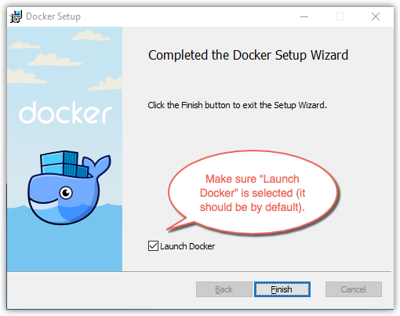

## 步骤 2. 启动 Docker for Windows

当安装完成后, Docker 自动启动.

状态栏的鲸鱼图标表示 Docker 正在运行, 并可以从终端访问.

如果你刚刚安装了应用程序, 将会弹出包含下一步建议以及本文档链接的成功消息.

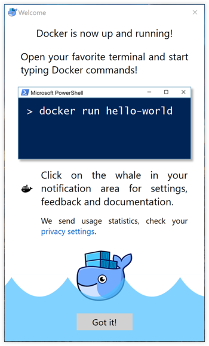

初始化完成后, 从通知区域图标中选择 **关于 Docker** 以验证您是否具有最新版本.

恭喜! 您正在使用 Docker for Windows 运行.

## 步骤 3. 检查 Docker Engine, Compose 与 Machine 的版本

打开您最爱的 Shell (`cmd.exe`, PowerShell 等) 来检查 `docker` 与 `docker-compose` 的版本, 并验证安装.

      PS C:\Users\samstevens> docker --version
      Docker version 1.12.0, build 8eab29e, experimental

      PS C:\Users\samstevens> docker-compose --version
      docker-compose version 1.8.0, build d988a55

      PS C:\Users\samstevens> docker-machine --version
      docker-machine version 0.8.0, build b85aac1

## 步骤 4. 探索应用, 运行示例

接下来的几个步骤带你完成一些示例, 这些只是建议在您的系统上实验 Docker 的方法, 请检查版本信息, 确保 `docker` 命令正常工作.

1. 打开一个 shell (`cmd.exe`, PowerShell 等).

2. 运行一些 Docker 命令, 例如 `docker ps`, `docker version` 和 `docker info`.

    此处是 `docker ps` 在 powershell 中运行的输出. (在本示例中, 尚未运行任何容器)

          PS C:\Users\samstevens> docker ps
          CONTAINER ID        IMAGE               COMMAND             CREATED             STATUS              PORTS               NAMES

    此处是 `docker version` 命令输出的示例.

          PS C:\Users\Vicky> docker version
          Client:
          Version:      1.12.0
          API version:  1.24
          Go version:   go1.6.3
          Git commit:   8eab29e
          Built:        Thu Jul 28 21:04:48 2016
          OS/Arch:      windows/amd64
          Experimental: true

          Server:
          Version:      1.12.0
          API version:  1.24
          Go version:   go1.6.3
          Git commit:   8eab29e
          Built:        Thu Jul 28 21:04:48 2016
          OS/Arch:      linux/amd64
          Experimental: true

    此处是 `docker info` 命令输出的示例.

          PS C:\Users\Vicky> docker info
          Containers: 0
          Running: 0
          Paused: 0
          Stopped: 0
          Images: 0
          Server Version: 1.12.0
          Storage Driver: aufs
          Root Dir: /var/lib/docker/aufs
          Backing Filesystem: extfs
          Dirs: 0
          Dirperm1 Supported: true
          Logging Driver: json-file
          Cgroup Driver: cgroupfs
          Plugins:
          Volume: local
          Network: host bridge null overlay
          Swarm: inactive
          Runtimes: runc
          Default Runtime: runc
          Security Options: seccomp
          Kernel Version: 4.4.16-moby
          Operating System: Alpine Linux v3.4
          OSType: linux
          Architecture: x86_64
          CPUs: 2
          Total Memory: 1.95 GiB
          Name: moby
          ID: BG6O:2VMH:OLNV:DDLF:SCSV:URRH:BW6M:INBW:OLAC:J7PX:XZVL:ADNB
          Docker Root Dir: /var/lib/docker
          Debug Mode (client): false
          Debug Mode (server): false
          Registry: https://index.docker.io/v1/
          Experimental: true
          Insecure Registries:
          127.0.0.0/8

    >**注意:** 以上输出仅供示例, 类似 `docker version` 与 `docker info` 命令的输出取决于您的产品版本 (例如, 当您安装较新的版本).

3.  运行 `docker run hello-world` 以测试从 Docker Hub 拉取镜像并启动容器.

          PS C:\Users\samstevens> docker run hello-world

          Hello from Docker.
          This message shows that your installation appears to be working correctly.

          To generate this message, Docker took the following steps:
          1. The Docker client contacted the Docker daemon.
          2. The Docker daemon pulled the "hello-world" image from the Docker Hub.
          3. The Docker daemon created a new container from that image which runs the executable that produces the output you are currently reading.
          4. The Docker daemon streamed that output to the Docker client, which sent it to your terminal.

4. 来点更了不起的, 在 Bash shell 中运行一个 Ubuntu 容器.

          $ docker run -it ubuntu bash

          PS C:\Users\samstevens> docker run -it ubuntu bash
          Unable to find image 'ubuntu:latest' locally
          latest: Pulling from library/ubuntu
          5a132a7e7af1: Pull complete
          fd2731e4c50c: Pull complete
          28a2f68d1120: Pull complete
          a3ed95caeb02: Pull complete
          Digest: sha256:4e85ebe01d056b43955250bbac22bdb8734271122e3c78d21e55ee235fc6802d
          Status: Downloaded newer image for ubuntu:latest

    输入 `exit` 以停止容器并关闭 Bash shell.

5. 使用该命令来开启一个 Docker 化的 web 服务器:

          docker run -d -p 80:80 --name webserver nginx

      这将下载并启动 `nginx` 容器镜像, 这里是在 PowerShell 中运行该命令的输出.

          PS C:\Users\samstevens> docker run -d -p 80:80 --name webserver nginx
          Unable to find image 'nginx:latest' locally
          latest: Pulling from library/nginx

          fdd5d7827f33: Pull complete
          a3ed95caeb02: Pull complete
          716f7a5f3082: Pull complete
          7b10f03a0309: Pull complete
          Digest: sha256:f6a001272d5d324c4c9f3f183e1b69e9e0ff12debeb7a092730d638c33e0de3e
          Status: Downloaded newer image for nginx:latest
          dfe13c68b3b86f01951af617df02be4897184cbf7a8b4d5caf1c3c5bd3fc267f

6.  在浏览器中访问 `http://localhost` 以显示开始页面.

    (由于您指定了默认的 HTTP 端口, 没有必要在 URL 的结尾加上 `:80`.)

      

7.  在 web 服务器工作时运行 `docker ps` 以检视容器细节.

          PS C:\Users\samstevens> docker ps
          CONTAINER ID        IMAGE               COMMAND                  CREATED             STATUS              PORTS
          NAMES
          dfe13c68b3b8        nginx               "nginx -g 'daemon off"   3 days ago          Up 45 seconds       0.0.0.0:80->80/tcp, 443/tc
          p   webserver

8. 停止或删除容器与镜像.

    `nginx` web 服务器会在您停止和 / 或删除容器前继续在容器中运行. 如果您要停止 web 服务器, 请输入 `docker stop webserver`, 可以使用 `docker start webserver` 再次启动它.

    要使用单个命令停止和删除正在运行的容器, 请键入: `docker rm -f webserver`. 这将删除容器而非 `nginx` 镜像. 您可以用 `docker images` 列出本地镜像. 您可能希望保留一些镜像, 这样就不必再从Docker Hub 中拉取它们. 要删除不再需要的镜像, 请使用 `docker rmi <imageID>|<imageName>`, `docker rmi nginx`.

**想要更多示例应用??** - 更多有关使用 Docker Compose 安装服务与数据库的示例, 请参见[示例应用程序](examples.md).

## 在 PowerShell 中设置 tab 自动补全

如果想要输入 Docker 命令时拥有 tab 自动补全的功能, 您可以安装 <a href="https://github.com/samneirinck/posh-docker">posh-docker</a> PowerShell 模块.

1. 开始一个"提升的" PowerShell (即作为管理员身份运行).

    为此, 请搜索 PowerShell, 右键单击, 然后选择**以管理员身份运行**.<br>

    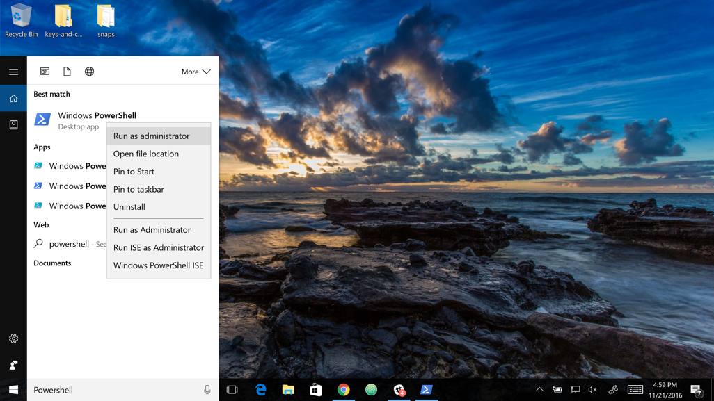
    <br><br>
    当系统询问您是否允许此应用更改设备时, 请点击**是**.

2. 配置[脚本执行策略](https://msdn.microsoft.com/en-us/powershell/reference/5.1/microsoft.powershell.security/set-executionpolicy)以允许下载的受信任发布者签名的脚本在您的计算机上运行, 为此, 请在 PowerShell 提示符键入:
    <br>
    `Set-ExecutionPolicy RemoteSigned`
    <br>
    要检查此策略是否被正确设置, 运行 `get-executionpolicy`, 应该返回 `RemoteSigned`.
    <br>
3. 要仅为当前 PowerShell 启用自动完成命令, 请键入:

    `Import-Module posh-docker`

4. 要使 tab 自动补全在所有 PowerShell 会话中生效, 在 PowerShell 提示符下键入这些命令将命令添加到一个 `$PROFILE`.

        Install-Module -Scope CurrentUser posh-docker -Force
        Add-Content $PROFILE "`nImport-Module posh-docker"

    如果 `$PROFILE` 不存在, 将被自动创建, 然后这一行被加入到文件中:

    `Import-Module posh-docker`

    <br>
    要检查文件是否已正确创建, 或者想手动编辑, 请在 PowerShell 中键入:

    `Notepad $PROFILE`

现在, 当您键入前几个字母后按 tab 键时, Docker 命令 (如 `start`, `stop`, `run`) 及其选项以及容器、镜像名称应该会自动补全.

## Docker 设置

当 Docker 运行时, Docker 鲸鱼图标在系统托盘中显示. 如果已隐藏, 请单击托盘中的向上箭头.

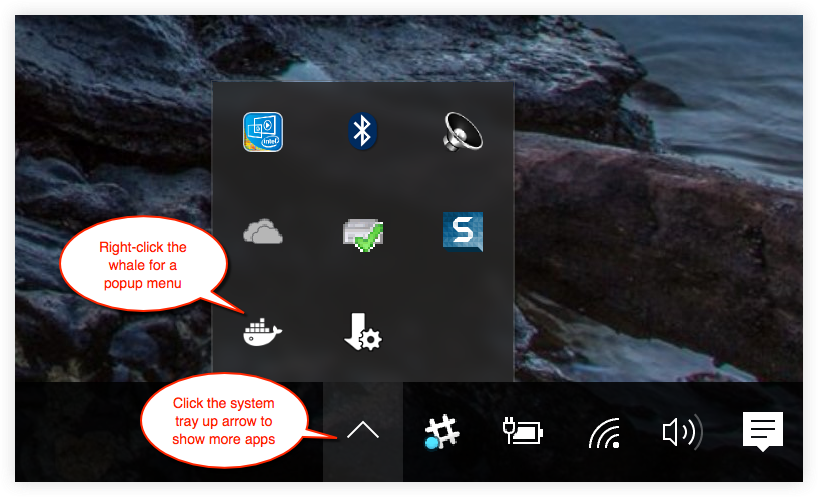

要弹出包含应用程序选项的弹出菜单, 请右键单击鲸鱼:

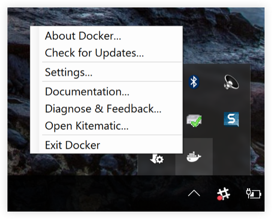

**设置**对话框提供了一些选项, 包括允许 Docker 自动启动, 自动检查更新, 与 Docker 容器共享本地驱动器, VPN, 管理 Docker 使用的 CPU 和内存, 重新启动 Docker, 恢复出厂设置.

**Beta 26 或更新版本**包括在 Windows 和 Linux 容器之间切换的选项, 请参阅[在 Windows 和 Linux 容器之间切换 (测试功能)](index.md#switch-between-windows-and-linux-containers-beta-feature). 目前该功能在稳定版本上不可用.

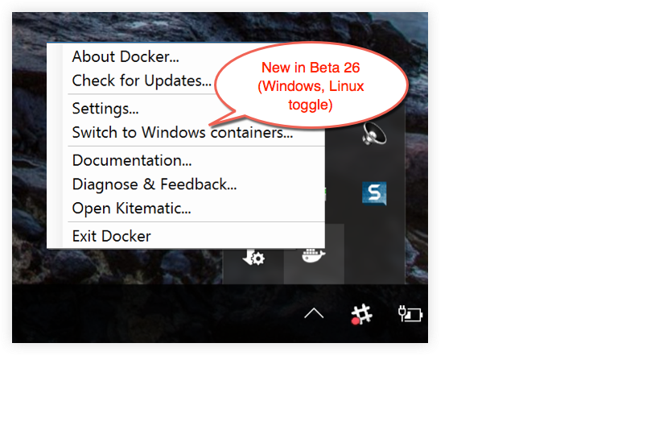


### 一般

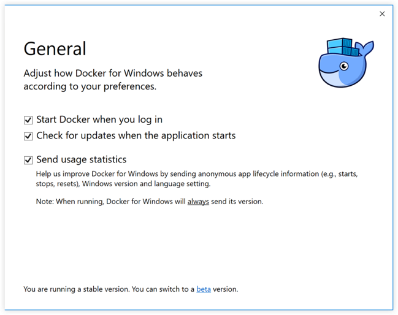

* **Start Docker when you log in (在登录时启动 Docker)** - 在 Windows 系统登录时自动启动 Docker for Windows.

* **Check for updates when the application starts (应用程序启动时检查更新)** - Docker for Windows 设置为自动检查更新, 并在更新可用时通知您. 如果找到更新, 单击**确定**接受并安装 (或者取消并保留当前版本). 如果您不想得到版本升级通知, 请取消选中此选项. 您仍可以通过从菜单中选择**检查更新**来手动获取更新.

* **Send usage statistics (发送使用情况统计信息)** - 您可以设置让 Docker for Windows 自动发送诊断信息, 崩溃报告和使用数据, 这些信息可以帮助 Docker 改进应用并获得更多的上下文以解决问题.

    取消选中任何选项即可停用并阻止自动发送数据. 即使选择了自动发送, Docker 在某些情况下可能会提示更多信息. 此外, 在首次启动 Docker 时单击信息弹出窗口可以启用或禁用这些自动报告设置.

    

### 共享驱动器

与 Docker for Windows 共享您的本地驱动器 (卷), 使得本地驱动器在您的容器中可用.

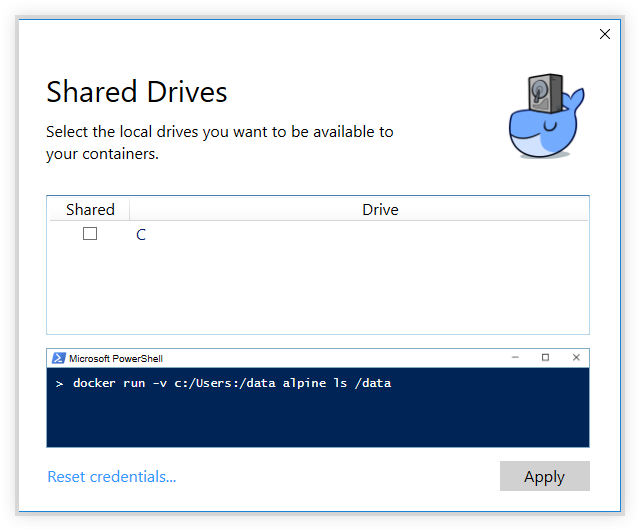

系统将要求您提供 Windows 系统用户名和密码 (域用户) 以启用共享驱动器, 您可以选择让 Docker 存储凭据, 这样您就不必每次都重新输入.

访问共享驱动器的权限与您在此处提供的凭据相关联. 如果您的用户名与设置共享的用户名不同, 运行 `docker` 命令和任务时您的容器将无权访问已装载的卷.

>**提示:** 一般来说, 只有 [Linux 容器](#switch-between-windows-and-linux-containers-beta-feature)挂载卷时需要共享驱动器卷挂载Linux容器, 而 Windows 容器不需要. 然而, 如果项目位于 `\Users` 之外, 即使正在使用 [Windows 容器](#getting-started-with-windows-containers-beta-feature), 您仍然需要共享 Dockerfile 与卷所在的驱动器. 诸如文件未找到或无法启动服务之类的运行时错误可能指示了需要共享驱动器. (另请参见 [Linux 容器, 以及任何位于 `C:\Users` 之外的项目的卷挂载需要共享驱动器](troubleshoot.md#volume-mounting-requires-shared-drives-for-linux-containers-and-for-any-project-directories-outside-of-cusers).)

另请参阅在疑难解答中的[验证域用户是否具有共享驱动器的权限](troubleshoot.md#verify-domain-user-has-permissions-for-shared-drives-volumes).
 
#### 共享驱动器的防火墙规则

共享驱动器需要在主机和运行 Linux 容器的虚拟机之间打开 445 端口.

>**注意**: 在Docker for Windows Beta 29 及更高版本中, Docker 会检测 445 端口是否关闭, 并在尝试添加共享驱动器时提示如下信息: 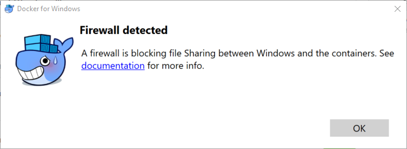

要共享驱动器, 请在 Windows 防火墙或您的第三方防火墙软件中允许 Windows 主机和虚拟机之间的连接. 您不需要在任何其它网络上打开 445 端口. 默认情况下, 应允许从 10.0.75.2 (虚拟机) 到 10.0.75.1 的 445 端口 (Windows 主机) 的连接.

### 高级

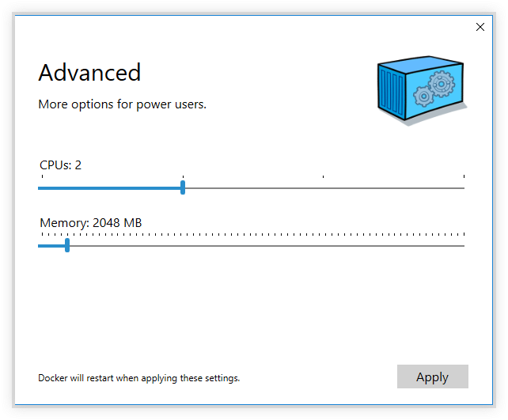

* **CPUs** - 更改分配给Linux 虚拟机的处理器数.

* **Memory (内存)** - 更改 Docker for Windows 的 Linux 虚拟机使用的内存量.

请注意, 更新这些设置需要重新配置与重启 Linux 虚拟机, 这将需要几秒钟.

### 网络

您可以将 Docker for Windows 的网络配置为在虚拟专用网络 (VPN) 上工作.

* **Internal Virtual Switch (内部虚拟交换机)** - 您可以指定网络地址转换 (NAT) 前缀和子网掩码以启用 Internet 连接.

* **DNS Server (DNS服务器)** - 您可以将 DNS 服务器配置为使用动态或静态 IP 地址.

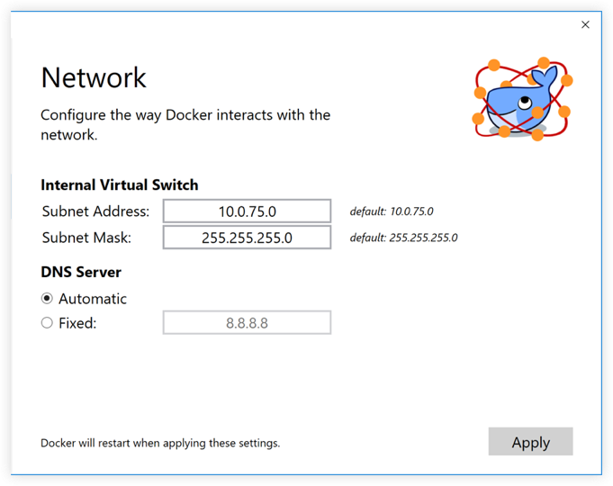

>**注意:** 一些用户报告在 Docker for Windows 的稳定版本上存在与 Docker Hub 的连接问题, 这个问题表现为运行 `docker` 命令从 Docker Hub 拉取一个尚未下载的镜像 (例如第一次运行 `docker run hello-world`) 时发生错误. 如果遇到此问题, 请重设 DNS 服务器以使用 Google DNS 的固定地址: `8.8.8.8`. 有关更多信息, 请参阅故障排除中的[网络问题](troubleshoot.md#networking-issues).

请注意, 更新这些设置需要重新配置和重启 Linux 虚拟机.

### 代理

Docker for Windows 允许您配置 HTTP/HTTPS 代理设置, 并自动传播配置到 Docker 和您的容器.
例如, 如果您将代理设置为 `http://proxy.example.com`, Docker 将在拉取容器时使用此代理.

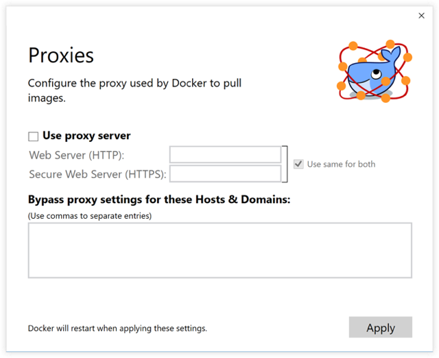

当您启动容器时, 您将观察到代理设置传播到容器中, 例如:

```
$ docker run -it alpine env
PATH=/usr/local/sbin:/usr/local/bin:/usr/sbin:/usr/bin:/sbin:/bin
HOSTNAME=b7edf988b2b5
TERM=xterm
HOME=/root
HTTP_PROXY=http://proxy.example.com:3128
http_proxy=http://proxy.example.com:3128
no_proxy=*.local, 169.254/16
```

您可以从上面的输出中观察到 `HTTP_PROXY`, `http_proxy` 和 `no_proxy` 环境变量均已设置.
当代理配置更改时, Docker 会自动重新启动以获取新设置.
如果希望在重新启动时保持运行某些容器, 则应考虑使用[重新启动策略](/engine/reference/run/#restart-policies-restart)

### Docker 守护进程

您可以在给定的 JSON 配置文件中配置 Docker 守护进程的选项, 并确定容器的运行方式.

有关 Docker 守护进程的完整选项列表, 请参阅 Docker Engine 命令行参考中的<a href="https://docs.docker.com/engine/reference/commandline/dockerd/" target="_blank">守护进程</a>.

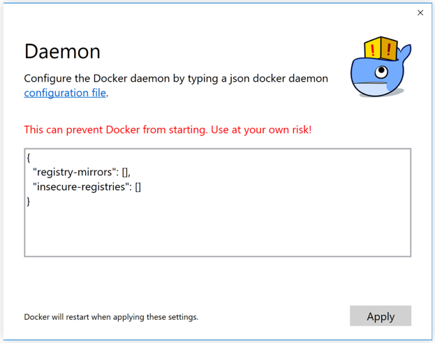

请注意, 更新这些设置需要重新配置和重启 Linux 虚拟机.

### 在 Windows 和 Linux 容器之间切换 (测试版功能)

从 Beta 26 版开始, 您可以选择 Docker CLI 会话的守护进程 (Linux 或 Windows), 选择 **Switch to Windows containers** 以切换到 Windows 容器, 选择 **Switch to Linux containers** 以切换到 Linux 容器.

微软开发者网络的[这个地方](https://msdn.microsoft.com/en-us/virtualization/windowscontainers/about/about_overview)包含 Windows 容器的初步/草稿信息.

此功能在稳定版本中尚未提供.

另请参见[共享驱动器](#shared-drives)

#### Windows容器入门 (测试版功能)

如果您对使用 Windows 容器感兴趣, 以下是帮助您开始使用的一些指南.

* [构建和运行您的第一个 Windows Server 容器 (博客文章)](https://blog.docker.com/2016/09/build-your-first-docker-windows-server-container/) 提供了如何在 Windows 10 和 Windows Server 2016 评估版本上构建和运行本机 Docker Windows 容器的导览.

* [Windows 容器入门 (实验室)](https://github.com/docker/labs/blob/master/windows/windows-containers/README.md) 向您介绍如何在 Windows 容器中使用 [MusicStore](https://github.com/aspnet/MusicStore/blob/dev/README.md) 应用. MusicStore 是一个标准的 .NET 应用程序, [使用容器的 fork 版本](https://github.com/friism/MusicStore)是多容器应用程序的一个好例子.

  >**免责声明:** 这个实验室还在完成中, 并且是基于博客内容的, 但如果您希望开始体验, 现在就可以测试、利用例子来做演练. 请关注实验室的进展.

### 诊断和反馈

如果您遇到了在本文档中找不到解决方案的问题, 请在 Docker for Windows GitHub 上的[问题页面](https://github.com/docker/for-win/issues)或 [Docker for Windows 论坛](https://forums.docker.com/c/docker-for-windows) 中搜寻其他用户已经提交的问题, 我们可以帮助您排除日志数据故障.

选择 **Upload a diagnostic**.

这将日志上传 (发送) 给 Docker.

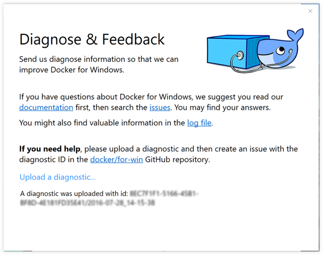

要直接在 GitHub 上创建新问题, 请使用浏览器打开 GitHub上打开 [Docker for Windows issues on GitHub](https://github.com/docker/for-win/issues) 并 README 中的说明进行操作. 单击该页面上的 [New Issue](https://github.com/docker/for-win/issues/new) 以获取创建新问题的模板, 其中已经写好了诊断信息的 ID 和摘要, 系统与版本详细信息, 预期和实际行为的描述与重现问题的步骤的片段.

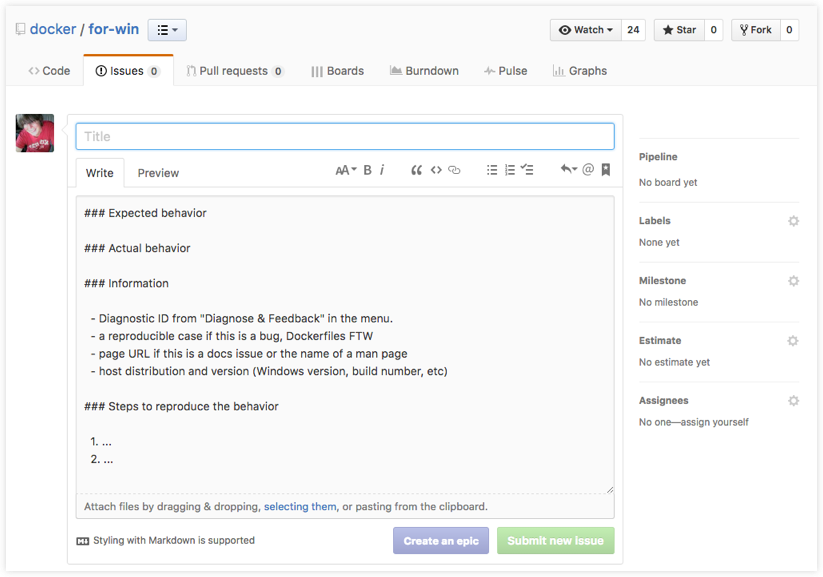

### 重启

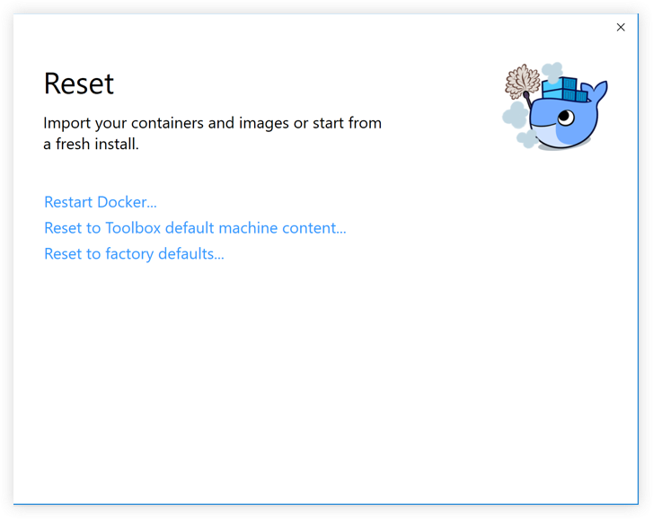

* **Restart Docker (重启 Docker)** - 关闭并重启 Docker 应用程序.

* **Reset to Toolbox default machine content (重置为 Toolbox 默认机器内容)** - 从名为 `default` 的现有 Docker Toolbox 机器中导入容器和映像. (该选项仅在 Toolbox 已安装时可用.) VirtualBox 虚拟机不会被删除.

* **Reset to factory defaults (重置为出厂默认值)** - 将 Docker 重置为出厂默认值, 这在 Docker 停止工作或无响应的情况下很有用.

<!-- ### Going back to Toolbox

If you want to go back to using Docker Toolbox, you have to disable the Hyper-V Windows feature. To do this, go to the Windows **Control Panel -> Programs and Features -> Turn Windows Features on or off**, uncheck Hyper-V, and click **OK**. You can then use `docker-machine` and VirtualBox to run Docker containers.

[These instructions](https://msdn.microsoft.com/en-us/virtualization/hyperv_on_windows/quick_start/walkthrough_install), which explain how to *enable* Hyper-V, show you how to get to the on/off controls for the Hyper-V feature. -->

## 下一步

* 学习 [Docker 入门教程](/engine/getstarted/index.md).

* 深入了解在 Docker Hub 上构建镜像, 运行容器, 网络, 管理数据与存储镜像的[示例教程](/engine/tutorials/index.md).

* 参阅[示例应用程序](examples.md), 示例程序包含在 Docker Compose 中设置服务和数据库.

* 对在 Docker Engine v1.12 上试用新的 [Swarm 模式](/engine/swarm/index.md)感兴趣?

    请参阅[开始使用 Swarm 模式](/engine/swarm/swarm-tutorial/index.md), 这是介绍了如何利用 Docker for Windows 来运行单节点和多节点集群的教程.

    此外, 在 [Docker 实验室](https://github.com/docker/labs/tree/master/swarm-mode/beginner-tutorial)中尝试 Swarm 示例. 运行 `bash script`脚本, 并跟着相应的 [Docker Swarm 教程](https://github.com/docker/labs/blob/master/swarm-mode/beginner-tutorial/README.md)来学习. 该脚本使用 Docker Machine 创建多节点集群, 并引导您完成各种 Swarm 任务和命令.

* 有关 Docker 命令行接口 (CLI) 命令的摘要, 请参阅 [Docker CLI参考指南](/engine/reference/index.md).

* 查看 Docker for Mac 和 Docker for Windows 公共 beta 版的<a href="https://blog.docker.com/2016/06/docker-mac-windows-public-beta/">博客文章</a>, 以及最初的私人测试版的<a href="https://blog.docker.com/2016/03/docker-for-mac-windows-beta/">更早版本</a>.

* 请通过登录我们的 [Docker for Windows 论坛](https://forums.docker.com/c/docker-for-windows)提供您对应用程序的体验反馈并报告错误和问题.
