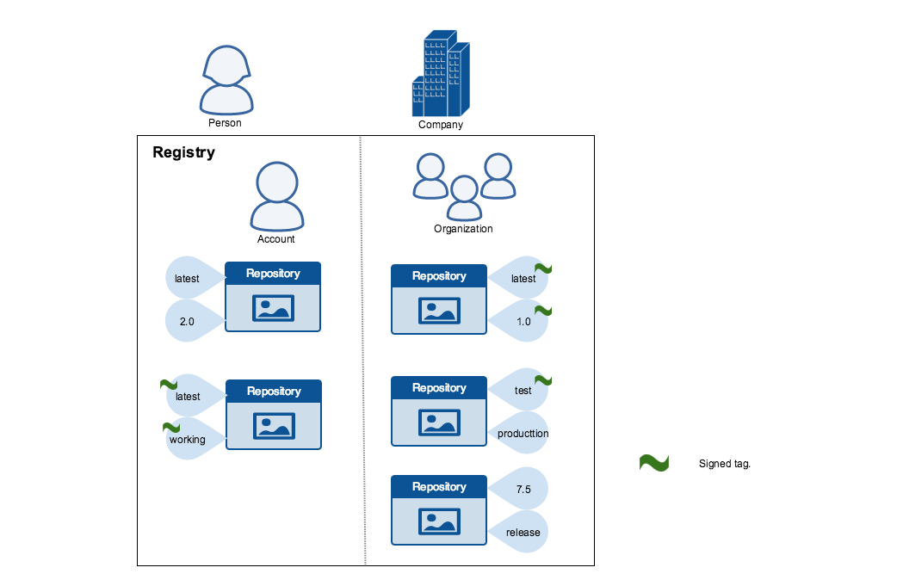

当在互联的系统间传递数据时，"信任"是一个主要考虑点。
尤其在如互联网等不可信媒体间通信时，确认一个系统所操作数据的完整性和发布者是非常关键的。
你可以使用Docker Engine 来上传下载镜像（数据）到公共或私有的Docker Reigstry.
内容信任让你有能力去校验在任何网络通道从Docker Registry收到的数据的完整性和发布者。

## 理解Docker的信任

内容信任允许对远程Docker Registry的操作启用客户端签名和镜像tag验证。
内容信任提供对远程Docker Registry的发送内容进行电子签名的能力。
这些签名允许客户端对特定的镜像版本进行完整性和发布者校验。

目前，内容信任默认是关闭的。你必须通过设置"DOCKER_CONTENT_TRUST"环境变量来开启。请参见
[环境变量](../../reference/commandline/cli.md#environment-variables)
和[Notary](../../reference/commandline/cli.md#notary)配置来查看更多docker客户端参数。

一旦内容信任开启，镜像发布者必须对自己的镜像进行签名。镜像消费者可以保证自己使用的镜像都被签名了。
发布者和消费者可以是独立个人或者组织。Docker的内容安全支持用户和如构建等自动化进程。

### 镜像tag和内容信任

一个唯一的镜像记录有如下的标示：

```
[REGISTRY_HOST[:REGISTRY_PORT]/]REPOSITORY[:TAG]
```

一个特定的镜像"仓库"可以有多个tag。比如，'latest'和'3.1.2'都是'mongo'镜像的tag。
一个镜像发布者可以构建一个镜像并且给每个构建一个tag。
内容信任和镜像的tag相关联。每个镜像仓库有一组秘钥用来让镜像发布者签名镜像tag。
镜像发布者可以判别签名了哪些tag。

一个镜像仓库可以包含一个签名了的tag和另一个没签名的tag。
比如，[the Mongo image repository](https://hub.docker.com/r/library/mongo/tags/)
'latest'tag没有签名，而'3.1.6'tag签名了。
这是由镜像发布者的责任来决定哪些镜像tag要还是不要签名。
在下面的展示中，一些镜像tag签名了，另一些没有：




发布者可以选择签名或不签名一个特定的tag。作为结果，相同tag名称的签名内容和不签名内容并不一致。
比如，一个发布者可以上传一个镜像tag "someimage:latest" 并签名。然后同样的发布者可以上传一个未签名的镜像 "someimage:latest"。
第二次上传替换了上一次未签名tag"latest"，但是不会影响签名的"latest"版本。
这个选择哪个tag签名的能力，使得发布者可以在正式签名前不断迭代未签名版本的镜像。

镜像消费者可以启动内容信任去保证使用的镜像都被签名了。如果一个消费者启动了内容信任，他们只能下载、运行、构建信任镜像。
启动内容信任就像戴了一副玫瑰色眼镜。消费者只能看到签名的镜像tag而看不见未签名的tag。


对于还没有开启内容安全的消费者，和镜像相关的工作完全没有变化。不管是否被加签，每个镜像都是可见的。


### 内容信任操作和秘钥

当内容信任开启，"docker"操作镜像tag的命令要带有内容签名或显式的内容哈希。以下是和内容信任相关的命令：

* `push`
* `build`
* `create`
* `pull`
* `run`

比如，当内容信任开启时，`docker pull someimage:latest` 只有当`someimage:latest`签名了才能成功。
另外，带有显式内容哈希并且这个哈希存在的命令也会成功。

```bash
$ docker pull someimage@sha256:d149ab53f8718e987c3a3024bb8aa0e2caadf6c0328f1d9d850b2a2a67f2819a
```
一个镜像tag的信任是由签名秘钥管理。当内容信任第一次调用时，一组秘钥集会创建。
一组秘钥集包含以下分类的秘钥：


- 一个离线的秘钥，作为一个镜像tag的内容信任的根
- 仓库或者用来签名的tagging秘钥 
- 服务端管理的秘钥，比如提供最新仓库安全保障的时间戳秘钥

下面的镜像描述了多种签名秘钥和他们的关系：


>**警告**: 丢掉根秘钥是非常难恢复的。恢复丢失的损失需要[Docker
>Support](https://support.docker.com) 的介入来重置仓库状态。
> 这个损失也需要每个使用签名tag的消费者的手动介入来恢复。

你需要在某处安全备份根秘钥。考虑到只有当创建新仓库时才需要根秘钥，离线存储在硬盘是一个好主意。
对于保障和备份你的秘钥，确保你阅读了如何[管理内容信任秘钥](trust_key_mng.md)。


## 典型内容信任操作的调查

这个部分调查了用户对Docker镜像进行的典型内容信任操作。
特别的，我们将通过以下步骤来帮助大家练习这些信任操作：

* 构建和推送一个未签名镜像 
* 拉取一个未签名镜像 
* 构建和推送一个签名镜像 
* 拉取上面这个签名镜像
* 拉取上面的未签名镜像

### 启动或关闭内容信息，每shell或每次调用

在一个shell,你可以通过设置环境变量`DOCKER_CONTENT_TRUST`来开启内容信任。
在shell级别开启非常有用，因为你可以让一个shell进行信任操作，另一个终端shell进行非信任操作。
你也可以添加声明到你的shell profile，使得始终默认开启。

开启内容信任在`bash` shell需要输入下面命令：

```bash
export DOCKER_CONTENT_TRUST=1
```

一旦设定，每个"tag"操作需要给一个信任tag一个秘钥。

在`DOCKER_CONTENT_TRUST`设置的环境，你可以使用`--disable-content-trust`标记去按需执行非内容安全的操作。

考虑下面使用非信任的基础镜像的Dockerfile:

```
$  cat Dockerfile
FROM docker/trusttest:latest
RUN echo
```

为了使用这个Dockerfile成功构建容器，可以如下操作：

```
$  docker build --disable-content-trust -t <username>/nottrusttest:latest .
Sending build context to Docker daemon 42.84 MB
...
Successfully built f21b872447dc
```

其他操作也是一样，比如`pull` 和 `push`

```
$  docker pull --disable-content-trust docker/trusttest:latest
...
$  docker push --disable-content-trust <username>/nottrusttest:latest
...
```

执行一个带内容安全的命令，不管`DOCKER_CONTENT_TRUST`变量是否开启：

```bash
$  docker build --disable-content-trust=false -t <username>/trusttest:testing .
```

所有的信任操作支持`--disable-content-trust` 标记。


### 推送信任安全

给一个指定镜像tag创建签名内容，简单开启内容安全并推送镜像。如果这是你第一次在你的系统上推送一个带内容安全的镜像，
会话看起来如下：

```bash
$ docker push <username>/trusttest:testing
The push refers to a repository [docker.io/<username>/trusttest] (len: 1)
9a61b6b1315e: Image already exists
902b87aaaec9: Image already exists
latest: digest: sha256:d02adacee0ac7a5be140adb94fa1dae64f4e71a68696e7f8e7cbf9db8dd49418 size: 3220
Signing and pushing trust metadata
You are about to create a new root signing key passphrase. This passphrase
will be used to protect the most sensitive key in your signing system. Please
choose a long, complex passphrase and be careful to keep the password and the
key file itself secure and backed up. It is highly recommended that you use a
password manager to generate the passphrase and keep it safe. There will be no
way to recover this key. You can find the key in your config directory.
Enter passphrase for new root key with id a1d96fb:
Repeat passphrase for new root key with id a1d96fb:
Enter passphrase for new repository key with id docker.io/<username>/trusttest (3a932f1):
Repeat passphrase for new repository key with id docker.io/<username>/trusttest (3a932f1):
Finished initializing "docker.io/<username>/trusttest"
```

当你第一次用内容安全给镜像打tag，`docker`客户端会识别为你的第一次推送并且：

 - 提示你它会创建一个新的根秘钥
 - 为这个根秘钥请求一个口令
 - 在 `~/.docker/trust` 目录生成一个根秘钥
 - 为仓库秘钥请求一个口令
 - 在 `~/.docker/trust` 目录生成一个仓库秘钥

你为根秘钥和仓库秘钥选择的口令应该随机生成，并保存在一个密码管理器。

> **提示**: 如果你丢掉了`testing` tag, 内容信任会漏过。及时内容安全已经开启并且是你第一次推送。

```bash
$ docker push <username>/trusttest
The push refers to a repository [docker.io/<username>/trusttest] (len: 1)
9a61b6b1315e: Image successfully pushed
902b87aaaec9: Image successfully pushed
latest: digest: sha256:a9a9c4402604b703bed1c847f6d85faac97686e48c579bd9c3b0fa6694a398fc size: 3220
No tag specified, skipping trust metadata push
```

正如消息提示，这个会略过，因为你没有指定镜像的`TAG`值。在Docker内容信任，签名始终和tag关联在一起。

一旦你在系统上有个一个根秘钥，后续的镜像仓库可以使用相同的根秘钥：

```bash
$ docker push docker.io/<username>/otherimage:latest
The push refers to a repository [docker.io/<username>/otherimage] (len: 1)
a9539b34a6ab: Image successfully pushed
b3dbab3810fc: Image successfully pushed
latest: digest: sha256:d2ba1e603661a59940bfad7072eba698b79a8b20ccbb4e3bfb6f9e367ea43939 size: 3346
Signing and pushing trust metadata
Enter key passphrase for root key with id a1d96fb:
Enter passphrase for new repository key with id docker.io/<username>/otherimage (bb045e3):
Repeat passphrase for new repository key with id docker.io/<username>/otherimage (bb045e3):
Finished initializing "docker.io/<username>/otherimage"
```

新镜像有自己的仓库秘钥和时间戳秘钥。`latest` tag被这两个同时签名。


### 拉取镜像安全

一个通常的消费镜像方式是`pull`。当内容安全开启，Docker客户端只允许`docker pull`获取签名的镜像。
让我们试试拉取你之前签名并推送的镜像：


```
$  docker pull <username>/trusttest:testing
Using default tag: latest
Pull (1 of 1): <username>/trusttest:testing@sha256:d149ab53f871
...
Tagging <username>/trusttest@sha256:d149ab53f871 as docker/trusttest:testing
```

在上面的示例中，命令并没有指定一个tag，那么系统会使用`latest`作为默认。`docker/trusttest:latest`还是没有被签名。

```bash
$ docker pull docker/trusttest
Using default tag: latest
no trust data available
```

因为`docker/trusttest:latest`没有被信任，所以`pull` 失败了。

## 相关信息

* [管理内容信任秘钥](trust_key_mng.md)
* [内容信任自动化](trust_automation.md)
* [内容信任-代理](trust_delegation.md)
* [在内容信任沙箱中运行](trust_sandbox.md)