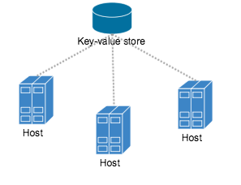
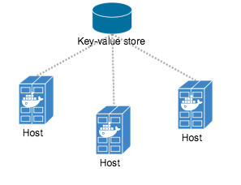
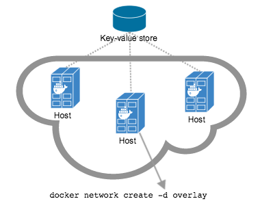
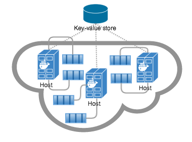

这一章会介绍Docker Engine原生提供的网络行为，包括默认会创建哪些网络以及怎样创建自己定制的网络，创建单个宿主机上的网络或者集群中跨宿主机的网络。

## 默认网络

当你安装好Docker之后， 它会自动的创建三个网络，你可以使用docker network ls命令列举这些3个网络：

```
$ docker network ls

NETWORK ID          NAME                DRIVER
7fca4eb8c647        bridge              bridge
9f904ee27bf5        none                null
cf03ee007fb4        host                host
```

最初，这3个网络是docker代码实现的一部分，你可以通过指定`--network`参数来指定容器启动(run)所在的网络。现在这三个网络还是同样可用的。

在所有的Docker安装版本中都会提供默认的`bridge`网络即`docker0`网络。如果你不指定`docker run --network=<NETWORK>`的话，Docker daemon 会默认将容器连接到这个网络。你可以通过`ifconfig`命令看到这个bridge是存在于宿主机(host)的网络栈中的。

```
$ ifconfig

docker0   Link encap:Ethernet  HWaddr 02:42:47:bc:3a:eb
          inet addr:172.17.0.1  Bcast:0.0.0.0  Mask:255.255.0.0
          inet6 addr: fe80::42:47ff:febc:3aeb/64 Scope:Link
          UP BROADCAST RUNNING MULTICAST  MTU:9001  Metric:1
          RX packets:17 errors:0 dropped:0 overruns:0 frame:0
          TX packets:8 errors:0 dropped:0 overruns:0 carrier:0
          collisions:0 txqueuelen:0
          RX bytes:1100 (1.1 KB)  TX bytes:648 (648.0 B)
```

`none`网络会添加容器到一个容器自己的网络栈，然后这个容器会并没有网络接口。Attach到这样的容器上然后检查他的网络栈，会有这样的结果：

```
$ docker attach nonenetcontainer

root@0cb243cd1293:/# cat /etc/hosts
127.0.0.1	localhost
::1	localhost ip6-localhost ip6-loopback
fe00::0	ip6-localnet
ff00::0	ip6-mcastprefix
ff02::1	ip6-allnodes
ff02::2	ip6-allrouters
root@0cb243cd1293:/# ifconfig
lo        Link encap:Local Loopback
          inet addr:127.0.0.1  Mask:255.0.0.0
          inet6 addr: ::1/128 Scope:Host
          UP LOOPBACK RUNNING  MTU:65536  Metric:1
          RX packets:0 errors:0 dropped:0 overruns:0 frame:0
          TX packets:0 errors:0 dropped:0 overruns:0 carrier:0
          collisions:0 txqueuelen:0
          RX bytes:0 (0.0 B)  TX bytes:0 (0.0 B)

root@0cb243cd1293:/#
```
>**Note**: 你可以通过`CTRL-p CTRL-q` detach并离开容器终端。

`host`网络添加一个容器到宿主机(host)的网络栈中，你会发现容器中的网络的配置是和宿主机(host)是一致的。

除了`bridge`网络，你不需要直接的操作这些默认的网络。你可以查看他们的列表和详情，但你不能移除他们。因为他们是Docker所需要的。不过你可以添加自定义的网络以及当你不需要这个网络是删除自定义的网络。不过在你了解自定义网络之前，可以先稍微了解一下默认的`bridge`网络。


### 默认bridge网络详解
在所有的docker主机上都会提供默认的`bridge`网络。通过`docker network inspect`命令可以查看关于这个网络的信息：

```
$ docker network inspect bridge

[
   {
       "Name": "bridge",
       "Id": "f7ab26d71dbd6f557852c7156ae0574bbf62c42f539b50c8ebde0f728a253b6f",
       "Scope": "local",
       "Driver": "bridge",
       "IPAM": {
           "Driver": "default",
           "Config": [
               {
                   "Subnet": "172.17.0.1/16",
                   "Gateway": "172.17.0.1"
               }
           ]
       },
       "Containers": {},
       "Options": {
           "com.docker.network.bridge.default_bridge": "true",
           "com.docker.network.bridge.enable_icc": "true",
           "com.docker.network.bridge.enable_ip_masquerade": "true",
           "com.docker.network.bridge.host_binding_ipv4": "0.0.0.0",
           "com.docker.network.bridge.name": "docker0",
           "com.docker.network.driver.mtu": "9001"
       },
       "Labels": {}
   }
]
```
Docker Enging会自动的为这个网络创建`Subnet`和`Gateway`的配置。然后`docker run`命令会将新的容器添加到这个网络中。

```
$ docker run -itd --name=container1 busybox

3386a527aa08b37ea9232cbcace2d2458d49f44bb05a6b775fba7ddd40d8f92c

$ docker run -itd --name=container2 busybox

94447ca479852d29aeddca75c28f7104df3c3196d7b6d83061879e339946805c
```
启动两个容器之后再通过inspect这个`bridge`网络可以看到在这个网络中新加入的两个容器，可以在"Containers"中找到他们的容器`ID`：

```
$ docker network inspect bridge

{[
    {
        "Name": "bridge",
        "Id": "f7ab26d71dbd6f557852c7156ae0574bbf62c42f539b50c8ebde0f728a253b6f",
        "Scope": "local",
        "Driver": "bridge",
        "IPAM": {
            "Driver": "default",
            "Config": [
                {
                    "Subnet": "172.17.0.1/16",
                    "Gateway": "172.17.0.1"
                }
            ]
        },
        "Containers": {
            "3386a527aa08b37ea9232cbcace2d2458d49f44bb05a6b775fba7ddd40d8f92c": {
                "EndpointID": "647c12443e91faf0fd508b6edfe59c30b642abb60dfab890b4bdccee38750bc1",
                "MacAddress": "02:42:ac:11:00:02",
                "IPv4Address": "172.17.0.2/16",
                "IPv6Address": ""
            },
            "94447ca479852d29aeddca75c28f7104df3c3196d7b6d83061879e339946805c": {
                "EndpointID": "b047d090f446ac49747d3c37d63e4307be745876db7f0ceef7b311cbba615f48",
                "MacAddress": "02:42:ac:11:00:03",
                "IPv4Address": "172.17.0.3/16",
                "IPv6Address": ""
            }
        },
        "Options": {
            "com.docker.network.bridge.default_bridge": "true",
            "com.docker.network.bridge.enable_icc": "true",
            "com.docker.network.bridge.enable_ip_masquerade": "true",
            "com.docker.network.bridge.host_binding_ipv4": "0.0.0.0",
            "com.docker.network.bridge.name": "docker0",
            "com.docker.network.driver.mtu": "9001"
        },
        "Labels": {}
    }
]
```

上面的`docker network inspect`会展示这个网络上所有连接的容器以及他们的网络资源，在这个默认网络中的容器可以通过他们的IP互相通信。Docker在默认的bridge网络中不支持自动服务发现(automatic service discovery)。如果你需要在这个默认bridge网络中使用容器名进行通信，你必须通过过时(legacy)的`docker run --link`选项连接这些容器。

你可以`attach`到一个运行中的`container`然后查看他的网络配置：

```
$ docker attach container1

root@0cb243cd1293:/# ifconfig
eth0      Link encap:Ethernet  HWaddr 02:42:AC:11:00:02
          inet addr:172.17.0.2  Bcast:0.0.0.0  Mask:255.255.0.0
          inet6 addr: fe80::42:acff:fe11:2/64 Scope:Link
          UP BROADCAST RUNNING MULTICAST  MTU:9001  Metric:1
          RX packets:16 errors:0 dropped:0 overruns:0 frame:0
          TX packets:8 errors:0 dropped:0 overruns:0 carrier:0
          collisions:0 txqueuelen:0
          RX bytes:1296 (1.2 KiB)  TX bytes:648 (648.0 B)

lo        Link encap:Local Loopback
          inet addr:127.0.0.1  Mask:255.0.0.0
          inet6 addr: ::1/128 Scope:Host
          UP LOOPBACK RUNNING  MTU:65536  Metric:1
          RX packets:0 errors:0 dropped:0 overruns:0 frame:0
          TX packets:0 errors:0 dropped:0 overruns:0 carrier:0
          collisions:0 txqueuelen:0
          RX bytes:0 (0.0 B)  TX bytes:0 (0.0 B)
```

然后使用`ping`发送三次ICMP请求测试与这个默认`bridge`网络中与其他容器的联通性。

```
root@0cb243cd1293:/# ping -w3 172.17.0.3

PING 172.17.0.3 (172.17.0.3): 56 data bytes
64 bytes from 172.17.0.3: seq=0 ttl=64 time=0.096 ms
64 bytes from 172.17.0.3: seq=1 ttl=64 time=0.080 ms
64 bytes from 172.17.0.3: seq=2 ttl=64 time=0.074 ms

--- 172.17.0.3 ping statistics ---
3 packets transmitted, 3 packets received, 0% packet loss
round-trip min/avg/max = 0.074/0.083/0.096 ms
```

最后，用`cat`命令检查`container1`网络的配置：

```
root@0cb243cd1293:/# cat /etc/hosts

172.17.0.2	3386a527aa08
127.0.0.1	localhost
::1	localhost ip6-localhost ip6-loopback
fe00::0	ip6-localnet
ff00::0	ip6-mcastprefix
ff02::1	ip6-allnodes
ff02::2	ip6-allrouters
```
使用`CTRL-p CTRL-q` detach `container1`这个容器并保持它后台运行。然后attach到`container2`并重复上面3个命令。

```
$ docker attach container2

root@0cb243cd1293:/# ifconfig
eth0      Link encap:Ethernet  HWaddr 02:42:AC:11:00:03
          inet addr:172.17.0.3  Bcast:0.0.0.0  Mask:255.255.0.0
          inet6 addr: fe80::42:acff:fe11:3/64 Scope:Link
          UP BROADCAST RUNNING MULTICAST  MTU:9001  Metric:1
          RX packets:15 errors:0 dropped:0 overruns:0 frame:0
          TX packets:13 errors:0 dropped:0 overruns:0 carrier:0
          collisions:0 txqueuelen:0
          RX bytes:1166 (1.1 KiB)  TX bytes:1026 (1.0 KiB)

lo        Link encap:Local Loopback
          inet addr:127.0.0.1  Mask:255.0.0.0
          inet6 addr: ::1/128 Scope:Host
          UP LOOPBACK RUNNING  MTU:65536  Metric:1
          RX packets:0 errors:0 dropped:0 overruns:0 frame:0
          TX packets:0 errors:0 dropped:0 overruns:0 carrier:0
          collisions:0 txqueuelen:0
          RX bytes:0 (0.0 B)  TX bytes:0 (0.0 B)

root@0cb243cd1293:/# ping -w3 172.17.0.2

PING 172.17.0.2 (172.17.0.2): 56 data bytes
64 bytes from 172.17.0.2: seq=0 ttl=64 time=0.067 ms
64 bytes from 172.17.0.2: seq=1 ttl=64 time=0.075 ms
64 bytes from 172.17.0.2: seq=2 ttl=64 time=0.072 ms

--- 172.17.0.2 ping statistics ---
3 packets transmitted, 3 packets received, 0% packet loss
round-trip min/avg/max = 0.067/0.071/0.075 ms
/ # cat /etc/hosts
172.17.0.3	94447ca47985
127.0.0.1	localhost
::1	localhost ip6-localhost ip6-loopback
fe00::0	ip6-localnet
ff00::0	ip6-mcastprefix
ff02::1	ip6-allnodes
ff02::2	ip6-allrouters
```

默认的`docker0`bridge网络支持用`docker run --link`允许容器间直接通信，那些在技术设置上复杂并易于出现错误。虽然现在在技术上仍然可以使用它们，但是最好避免使用，并使用自定义网络替代这种方案。

## 用户自定义网络

你可以通过创建自定义网络以便更好的容器网络隔离，Docker为创建自定义网络提供了一些默认的 **network driver**。你可以创建一个新的 **bridge network**， **overlay network**或者**MACVLAN network**。或者你可以编写及创建一个 **network plugin** 或者 **remote network**。

你也可以创建多个网络，可以把容器连接到不止一个网络中。容器仅可以同网络内的容器进行通信而不能跨网络通信。连接到两个网络中的容器可以分别同两个网络中其他容器进行通信。当一个容器连接到多个网络中时，他的与外部网络的连接会通过按名字排序的第一个非内部网络(non-internal network)提供。


下面的几章会非常详细的介绍每个Docker内置的网络驱动。

### bridge 网络

最简单的用户自定义网络就是创建一个`bridge`网络。这个网络类似于之前的，默认的`docker0`网络。有一些新加的特性以及废弃的老特性。

```
$ docker network create --driver bridge isolated_nw
1196a4c5af43a21ae38ef34515b6af19236a3fc48122cf585e3f3054d509679b

$ docker network inspect isolated_nw

[
    {
        "Name": "isolated_nw",
        "Id": "1196a4c5af43a21ae38ef34515b6af19236a3fc48122cf585e3f3054d509679b",
        "Scope": "local",
        "Driver": "bridge",
        "IPAM": {
            "Driver": "default",
            "Config": [
                {
                    "Subnet": "172.21.0.0/16",
                    "Gateway": "172.21.0.1/16"
                }
            ]
        },
        "Containers": {},
        "Options": {},
        "Labels": {}
    }
]

$ docker network ls

NETWORK ID          NAME                DRIVER
9f904ee27bf5        none                null
cf03ee007fb4        host                host
7fca4eb8c647        bridge              bridge
c5ee82f76de3        isolated_nw         bridge

```

当创建完网络之后，你可以通过使用`docker run --network=<NETWORK>`选项指定容器运行在这个网络上。

```
$ docker run --network=isolated_nw -itd --name=container3 busybox

8c1a0a5be480921d669a073393ade66a3fc49933f08bcc5515b37b8144f6d47c

$ docker network inspect isolated_nw
[
    {
        "Name": "isolated_nw",
        "Id": "1196a4c5af43a21ae38ef34515b6af19236a3fc48122cf585e3f3054d509679b",
        "Scope": "local",
        "Driver": "bridge",
        "IPAM": {
            "Driver": "default",
            "Config": [
                {}
            ]
        },
        "Containers": {
            "8c1a0a5be480921d669a073393ade66a3fc49933f08bcc5515b37b8144f6d47c": {
                "EndpointID": "93b2db4a9b9a997beb912d28bcfc117f7b0eb924ff91d48cfa251d473e6a9b08",
                "MacAddress": "02:42:ac:15:00:02",
                "IPv4Address": "172.21.0.2/16",
                "IPv6Address": ""
            }
        },
        "Options": {},
        "Labels": {}
    }
]
```

这些你在这个网络中启动的容器必须运行在同一个Docker主机上，每个在这个网络中的容器可以直接同其他容器进行通信。不过网络将容器同外部的网络隔离开。


在一个用户自定义网络中，是不支持link的。在这个网络中你可以expose和publish一个容器的端口，这个方案可以让你的自定义网络的一部分供外部网络访问。


如果你希望在单个机器上使用一个相对小的网络，bridge网络是非常有用的。然而，如果你需要一个相对大的网络，可以通过创建`overlay`的网络。

### `docker_gwbridge`网络

`docker_gwbridge`在两种场景下自动创建的本地`bridge`网络：

- 当你初始化和加入一个swarm时， Docker会创建`docker_gwbridge`网络并通过它与别的宿主机上的swarm的节点通信。
- 当容器的网络加入的网络不能提供外部网络连接时，Docker会额外的把容器连接到`docker_gwbridge`网络上，以保证容器的外部的网络连接或者连接其他的swarm节点。

如果你需要自定义`docker_gwbridge`，你可以预先手动创建`docker_gwbridge`网络。例如下面这个例子，通过自定义的参数创建`docker_gwbridge`:

```bash
$ docker network create --subnet 172.30.0.0/16 \
                        --opt com.docker.network.bridge.name=docker_gwbridge \
			--opt com.docker.network.bridge.enable_icc=false \
			docker_gwbridge
```

当使用`overlay`网络的话，也是会创建`docker_gwbridge`的。

### 使用Docker Engine Swarm mode配置的overlay网络

你可以在swarm mode的集群中的manager节点上创建overlay的网络而不需要额外的KV存储，swarm提供给需要overlay网络的服务所在的swarm节点overlay网络的联通，当你创建的一个服务使用到overlay网络的话，manager节点会自动的扩展overlay网络到每个运行这个服务的task的节点上。

想要了解更多关于swarm mode的内容，可以参考：
[Swarm mode总览](../../swarm/index.md).

通过下面的例子演示下如何在swarm的manager节点上如何创建网络并在一个service钟使用它：

```bash
# Create an overlay network `my-multi-host-network`.
$ docker network create \
  --driver overlay \
  --subnet 10.0.9.0/24 \
  my-multi-host-network

400g6bwzd68jizzdx5pgyoe95

# Create an nginx service and extend the my-multi-host-network to nodes where
# the service's tasks run.
$ docker service create --replicas 2 --network my-multi-host-network --name my-web nginx

716thylsndqma81j6kkkb5aus
```

直接通过`docker run`创建出的容器不能使用swarm的overlay网络，因为直接通过`docker run`创建出的容器不是归属于swarm mode service的，这个具体的信息可以参考[Docker Swarm mode网络Overlay网络模型](overlay-security-model.md) 以及 [挂载一个Swarm mode Service到Overlay网络](../../swarm/networking.md).

### 通过外部KV存储配置的overlay网络
如果你不是通过swarm mode方式使用的Docker Engine，`overlay`网络需要一个可用的key-value存储的服务。目前Docker的`libkv`支持Consul，Etcd，和ZooKepper(分布式存储)，在创建网络之前，你必须安装以及配置你所选的key-value存储服务。然后你需要创建网络的Docker机器以及存储服务的机器必须能够互相通信。

>**Note:** 通过swarm mode方式运行的Docker Engine和通过外部KV存储的Docker Engine不兼容



网络中的每个宿主机必须运行有Docker engine实例，最简单的创建运行Docker engine实例的方法是使用Docker Machine。



你在主机之间需要打开下面这些端口。

| 协议 | 端口 | 描述           |
|----------|------|-----------------------|
| udp      | 4789 | Data plane (VXLAN)    |
| tcp/udp  | 7946 | Control plane         |

你的Key-value存储服务可能需要额外的一些端口，可以检查服务提供者的文档然后打开需要的端口。

如果你打算创建加密的overlay网络(`--opt encrypted`)，你还需要保证50(ESP)端口是打开的。

一旦你有很多的机器创建出来，你可以使用包含发现服务的Docker Swarm快速的创建出一个集群。

为了创建overlay网络，你需要为每台机器上的Docker Engine的`daemon`配置`overlay`网络所需的选项。下面就是需要设置的三个选项。

<table>
    <thead>
    <tr>
        <th>参数</th>
        <th>描述</th>
    </tr>
    </thead>
    <tbody>
    <tr>
        <td><pre>--cluster-store=PROVIDER://URL</pre></td>
        <td>Describes the location of the KV service.</td>
    </tr>
    <tr>
        <td><pre>--cluster-advertise=HOST_IP|HOST_IFACE:PORT</pre></td>
        <td>The IP address or interface of the HOST used for clustering.</td>
    </tr>
    <tr>
        <td><pre>--cluster-store-opt=KEY-VALUE OPTIONS</pre></td>
        <td>Options such as TLS certificate or tuning discovery Timers</td>
    </tr>
    </tbody>
</table>

在Swarm集群中的一个节点上创建`overlay`网络

    $ docker network create --driver overlay my-multi-host-network

这个的结果就是创建了一个跨越多个节点的网络。一个`overlay`网络为容器提供了完全的网络隔离。



然后在每台主机上，通过指定网络名启动容器。  

    $ docker run -itd --network=my-multi-host-network busybox

连接上之后，每个容器便可以可以互相访问这个网络中的其他容器，不管另外的容器是在那一台主机上。



如果你想自己尝试下这个流程的话，可以参考[overlay网络入门](get-started-overlay.md).

### 自定义网络插件（Custom network plugin）

你可以编写自己的网络驱动，驱动是和Docker `daemon`运行在同一台主机上一个进程，并且由Docker `plugin`系统调用和使用。

网络插件和其他的Docker插件一样受到一些限制和安装规则。所有的插件使用Plugin API，有自己的生命周期，包含：安装，启动，停止，激活。

当你创建并安装了自定义的网络驱动是，你可以像内置的网络驱动一样使用它，例如：

    $ docker network create --driver weave mynet

你可以在这个网络上做查看(inspect)，添加删除容器等操作。当然，不同的驱动使用不同的技术和框架，所以自定义网络也会包含很多Docker默认网络没有的特性。如果需要了解更多关于编写插件的内容，可以参考[扩展Docker](../../extend/legacy_plugins.md) 和[编写自己的网络插件](../../extend/plugins_network.md).

### Docker内置DNS服务器(embedded DNS server)

Docker damon 会为每个连接到自定义网络的容器运行一个内置的DNS服务提供自动的服务发现。域名解析的请求会首先被内置的DNS服务器拦截，如果内置的DNS服务器不能够解析这个请求，它才会转发到外部的容器配置的DNS服务器。以便于这个机制，容器的`resolv.conf`文件会将DNS服务器配置为`127.0.0.11`，既内置DNS服务器监听的地址。更多关于在自定义网络中的内置DNS服务器可以参考 [自定义网络中的内置DNS服务器](configure-dns.md)

## Links

在Docker有这些网络特性之前，你需要使用Docker link的功能让容器间可以互相发现。有了Docker网络特性之后，容器可以通过容器名自动的互相发现。不过你可以继续使用link在自定义网络中，不过这个link的行为会和默认的`docker0` bridge网络上的行为不同。关于更多的信息和对比，可以参考：默认的`docker0`bridge上的[Legacy Links](default_network/dockerlinks.md) 行为
和 [自定义网络的link](work-with-networks.md#linking-containers-in-user-defined-networks)自定义网络中的行为.

## 相关链接

- [网络命令](work-with-networks.md)
- [跨主机网络入门](get-started-overlay.md)
- [管理容器的持久化数据](../../tutorials/dockervolumes.md)
- [Docker Machine一览](/machine)
- [Docker Swarm一览](/swarm)
- [研究libnetwork项目](https://github.com/docker/libnetwork)
